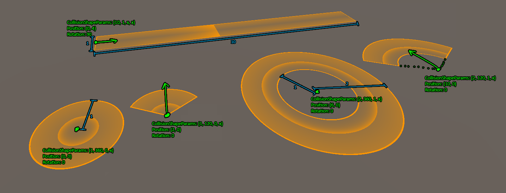

# FFXIV Mechanic Simulator Documentation
### Table of Contents  
1. [Mechanic File Structure](#MechanicFileStructure)
2. [Reference Mechanic Properties](#ReferenceMechanicProperties)
   - [Mechanic Properties](#MechanicProperties)
   - [Mechanic Lifetime](#MechanicLifetime)
   - [Collision Shapes](#CollisionShape)


## Mechanic File Structure <a name="MechanicFileStructure"/>

The basic mechanic file structure is as follows:
```javascript
{
  "referenceMechanicProperties": {...} // Contains properties of most mechanics
  
  "referenceTetherProperties": {...}   // Contains properties of tethers
  
  "mechanicPools": {...}               // Used for spawning mechanics randomly
  
  "referenceStatusProperties": {...}   // Contains properties of status effects
  
  "mechanicEvents": {...}              // The list of events to execute
}
```

## Reference Mechanic Properties <a name="ReferenceMechanicProperties"/>

The `referenceMechanicProperties` is a json object of the following form:

```javascript
{
  "MechanicName1" : { /* Properties of mechanic 1 */ },
  "MechanicName2" : { /* Properties of mechanic 2 */ },
  "MechanicName3" : { /* Properties of mechanic 3 */ },
  ...
}
```

Here, the `"MechanicName1"`, etc will be used as a reference to these mechanics from elsewhere in the mechanic file. This name will not be displayed in the simulator.

### Mechanic Properties <a name="MechanicProperties"/>

Almost everything about a specific mechanic is defined in the mechanic properties(the AOE shape, the amount of damage it does, whether it spawns other mechanics, etc). Here is a list of all available properties:
| Property Name | Default Value | Description |
| --- | --- | --- |
| `isTargeted` | `false` |True if you want the mechanic to "follow" its target player. |
| `followSpeed`| `0` | The speed at which to follow the player. A mechanic with a `followSpeed` of 0 but has `isTargeted` set to true will aim itself at the player, but won't move towards the player. |
| `collisionShape` | N/A | Either `"Round"` or `"Rectangle"`. Used in conjunction with `collisionShapeParams`. |
| `collisionShapeParams` | N/A | Used to define the size/etc of the AOE (see the [collision shape](#CollisionShape) section below for more details). |
| `colorHtml` | N/A | A hex color in the following form `#rrggbb` or `#rrggbbaa`. |
| `visible` | `true` | Should the AOE indicator be visible or not? (Setting this to false is useful for "dummy" mechanics that are only used to spawn other mechanics.) |
| `persistentTickInterval` | 0 | If the AOE is a persistent mechanic (puddle, etc), this is the rate at which the `persistentMechanic` is activated. |
| `persistentActivationDelay` | 0 | The number of seconds to wait before starting the persistent mechanic. |
| `mechanic` | N/A | The mechanic event for this mechanic to do once (apply damage, spawn other mechanics, etc). |
| `persistentMechanic` | N/A | The mechanic event that will be done every `persistentTickInterval` seconds. |
| `staticTargetIds` | N/A | Used for targeting schemes. |
| `mechanicTag` | N/A | An optional mechanic tag, mainly used for clearing all mechanics with a certain tag once an event is reached (boss hp, phase transition, etc). |

Many of these properties can be omitted from the mechanic definition if they won't be needed. For example, a mechanic with `visible` set to false won't need to specify the `colorHtml`, and a non-persistent mechanic won't need to specify any of the persistent mechanic properties.

In addition, for the properties with default values listed in the above table, they will take on those values if not specified explicitly. For example, you don't need to explicitly set `visible` to true for every AOE that you want to have visible, since the default is true.

### Mechanic Lifetime <a name="MechanicLifetime">

Upon spawning, every mechanic will proceed with the following logic:

1. The mechanic will immediately start executing the events specified in the `mechanic` property. Upon finishing these events, the mechanic will destroy itself (stopping any persistent events as well).
2. If the `persistentMechanic` is defined, it will first wait `persistentActivationDelay` seconds, then execute the `persistentMechanic` every `persistentTickInterval` seconds. 
   - If the mechanic is destroyed before the activation delay, then the persistent mechanic will not execute.
   - If the `persistentMechanic` is defined and the `mechanic` is not defined, then the mechanic will execute the persistent mechanic as described, and it will not destroy itself. (These can still be destroyed externally by events from other mechanics.)
  
### Collision Shape <a name="CollisionShape">

The collision shape is a collection of 4 numbers (x,y,z,w) that are used to define certain properties of the AOE, like radius for round AOEs or length for rectangle AOEs.


Above example from [Mechanics/SimpleAoeDemo.json](Mechanics/SimpleAoeDemo.json)
   
- Round
  - `x`: Outer radius of the AOE
  - `y`: Amount of degrees (360 for a circle shaped AOE, etc)
  - `z`: Inner radius of the AOE, for donut shapes (use 0 for a circle AOE)
  - `w`: unused
- Rectangle
  - `x`: Length of the AOE
  - `y`: Width of the AOE, *measured from the center*
  - `z`: unused
  - `w`: unused


