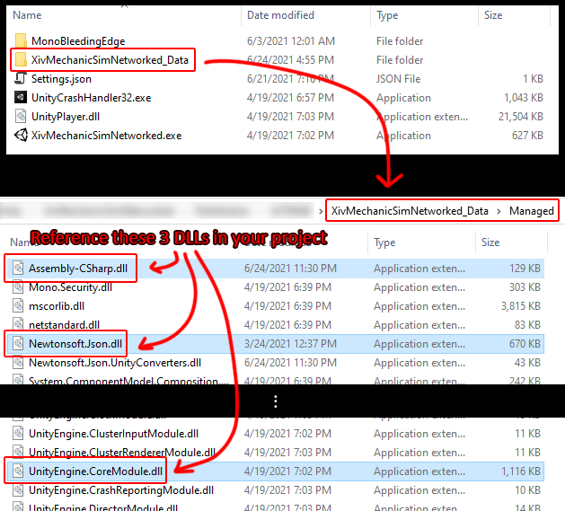

# Downloads

**Simulator Download:** [Releases](https://github.com/xiv-stats/xiv-sim-documentation/releases)

**Other Links:** [Discord](https://discord.gg/XjP3f2HXYy) | [Twitter](https://twitter.com/xiv_sim) | [Youtube](https://www.youtube.com/channel/UC_pX9gr7B-wd5nIBHafqiKw) | [Documentation (Wiki)](https://github.com/xiv-stats/xiv-sim-documentation/wiki)

#### Setup Guide
1. Download and extract the latest version from the [releases](https://github.com/xiv-stats/xiv-sim-documentation/releases) page.
2. If it is the first time you are running the simulator, you can click the **"Redownload Mechanic Files From Github"** button, which will automatically download the latest mechanic files files and place them in the correct place.
   - You can also download the mechanics folder manually from [here](https://github.com/xiv-stats/xiv-sim-mechanics) as well, and put it in the root directory of the app.

#### Host Setup
1. In order to host a room for multiplayer, you will need to enable port forwarding on your router. The steps for this will be different for each router.
2. The following settings should be used for port forwarding:
   - **Service Type:** TCP/UDP
   - **Internal Ports:** 7777~7778
   - **External Ports:** 7777~7778
   - **Server IPv4:** (The local IP of the computer that you will be running the simulator on.)
2. Once port forwarding is set up, you will be able to host by sharing your [public IP](https://whatismyipaddress.com/).

> ⚠**Note about checking if port forwarding is working:** Many online port forward checkers are not reliable and will report your port is closed even if it isn't. The best way to check is to have someone try to connect to you using the simulator. It should take a couple seconds for them to connect.

---

# Scripting Setup (C#)
As of the [`20210624-v2`](https://github.com/xiv-stats/xiv-sim-documentation/releases/tag/20210624-v2) release, you can now create the mechanic json files using C#. You can use any IDE/scripting environment that you would like.

In order to set up your project, you will need to reference the following 2 DLLs in your project, located in the `XivMechanicSimNetworked_Data/Managed` folder:

   

For development, I use [Linqpad](https://www.linqpad.net/) to write my scripts for generating the mechanic files. I have included all of the scripts that I have used to create the existing demos in this repo as a reference for how to create mechanics: [xiv-sim-documentation/Linqpad](https://github.com/xiv-stats/xiv-sim-documentation/tree/main/Linqpad)

